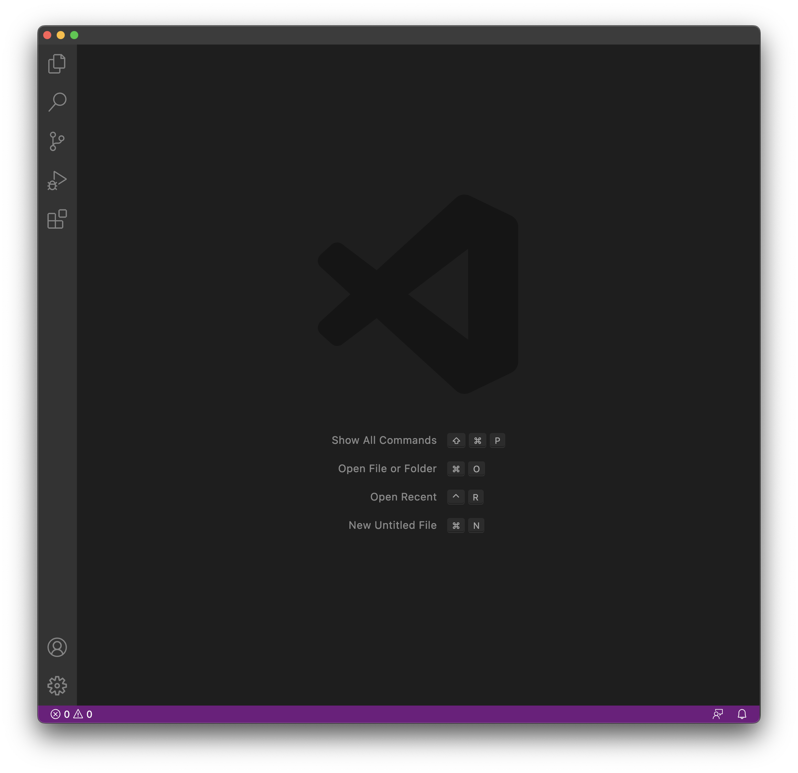
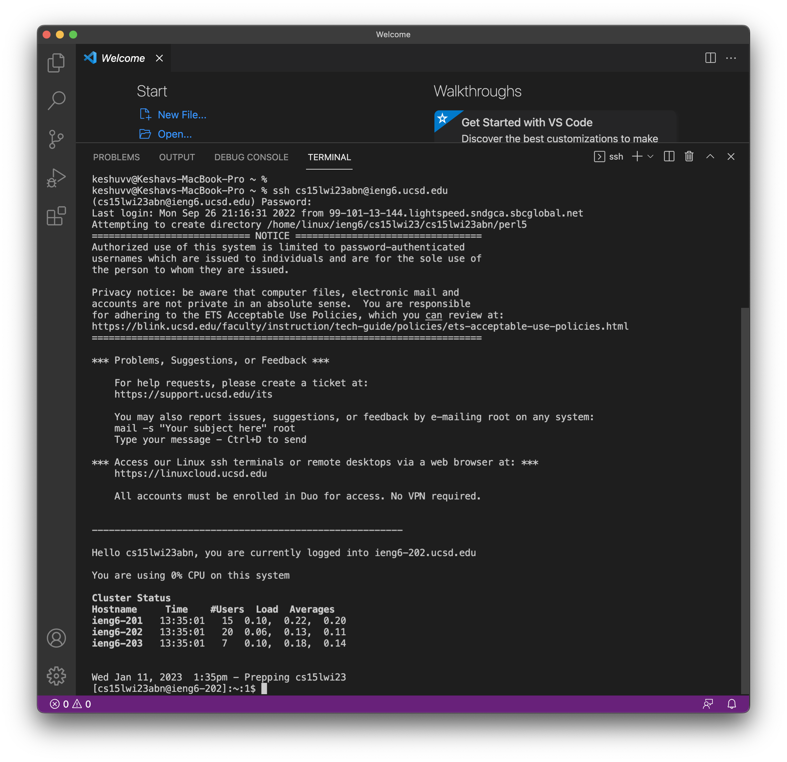

# Lab Report 2

## Part 1
   * Step 1: Click on this [link](https://code.visualstudio.com) to go to the Visual Studio Code website.
   * Step 2: Follow the instructions given on the website to download and install it on your computer. Please make sure to download the version that is most suitable for your operating system. 
   * Step 3: Once installed, open the application on your system. You should be able to see a window like the one given here below 
   * Step 4: Your Visual Studio Code environment is ready now! 
   
   
## Part 2
   * Step 0: (_Only for Windows users_) Follow this [link](https://git-scm.com/download/win) to install `git` for Windows. Now use the following steps to setup the default terminal by using `git bash` in Visual Studio Code. 
   * Step 1: To use `ssh`, open a terminal in VScode or use `Ctr` / `Command` + `. 
   * Step 2: Use the command `$ ssh cs15lwi23abn@ieng6.ucsd.edu` on the terminal. Make sure that you replace `abn` with the letters from your course-specific account. Also, note that we write `$` as a convention for how we write commands. 
   * Step 3: If this is your first time connecting to this server, you will probably get a message like this:
> `⤇ ssh cs15lwi23abn@ieng6.ucsd.edu 
The authenticity of host 'ieng6.ucsd.edu (128.54.70.227)' can't be established.
RSA key fingerprint is SHA256:ksruYwhnYH+sySHnHAtLUHngrPEyZTDl/1x99wUQcec.
Are you sure you want to continue connecting (yes/no/[fingerprint])?`
   * Step 4: Please type `yes` and then your password to move forward. Now, you should be able to see a window like the one given here below 
   * Step 5: You are now logged into your remote server! 
  

## Part 3
   * 
 
***Thank you for reviewing my lab report, appreciate it!*** 

