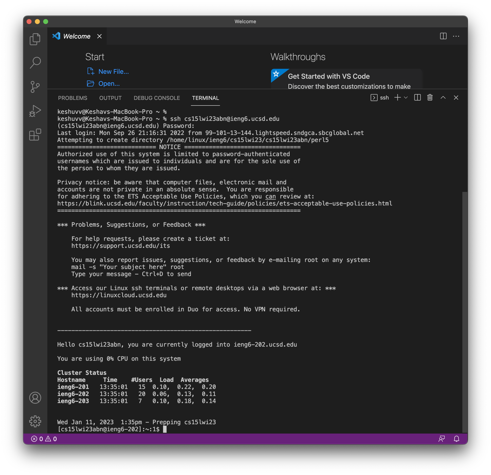
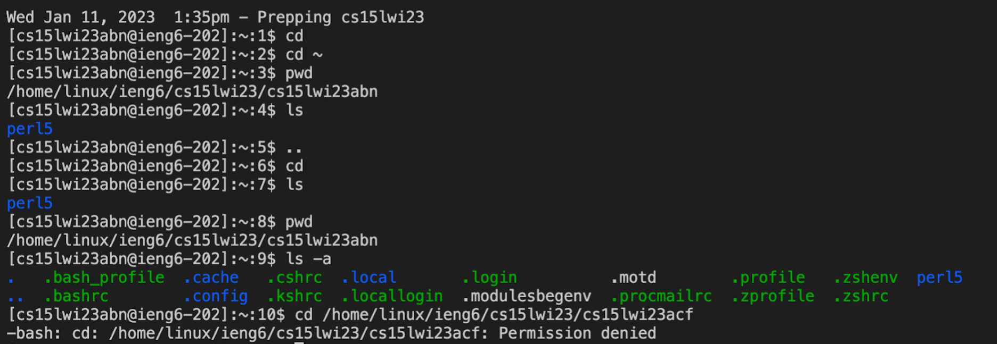

# Lab Report 3 

## _I have chosen the `grep` command. Following are some of the command line options for `grep` that I found interesting:_ 

### 1. `-i` option (aso used as `--ignore-case`)
   * Example 1: 
   * Example 2: 
   
### 2. Remotely Connecting
   * Step 0: (_Only for Windows users_) Follow this [link](https://git-scm.com/download/win) to install `git` for Windows. Now use the following steps to setup the default terminal by using `git bash` in Visual Studio Code. 
   * Step 1: To use `ssh`, open a terminal in VScode or use `Ctr` / `Command` + `. 
   * Step 2: Use the command `$ ssh cs15lwi23abn@ieng6.ucsd.edu` on the terminal. Make sure that you replace `abn` with the letters from your course-specific account. Also, note that we write `$` as a convention for how we write commands. 
   * Step 3: If this is your first time connecting to this server, you will probably get a message like this:
> `⤇ ssh cs15lwi23abn@ieng6.ucsd.edu 
The authenticity of host 'ieng6.ucsd.edu (128.54.70.227)' can't be established.
RSA key fingerprint is SHA256:ksruYwhnYH+sySHnHAtLUHngrPEyZTDl/1x99wUQcec.
Are you sure you want to continue connecting (yes/no/[fingerprint])?`
   * Step 4: Please type `yes` and then your password to move forward. Now, you should be able to see a window like the one given here below 
   * Step 5: You are now logged into your remote server! 
  

### 3. Trying Some Commands
   * Try running the commands `cd`, `ls`, `pwd`, `mkdir`, and `pw` on the terminal a few times. 
   * Use these commands in different ways to understand their usage and make a note of it.
   * A few other commands that you can try are: `cd ~`, `..`, `ls -a`, `ls -lat`, `ls <directory>` where `<directory>` is `/home/linux/ieng6/cs15lwi23/cs15lwi23abn`. Remember to replace `abn` with the letters from your course-specific account, and `cp /home/linux/ieng6/cs15lwi23/public/hello.txt ~/`
   * You should expect to see results like these 
   * `cd` - allows you to change directories.
   * `ls` - lists out all the files in that particualr directory. 
   * `ls -a` - lists out all the files including the hidden ones. 
   * `pwd` - tells you the current working directory of the user. 
   * `mkdir` - stands for making a new directory (Linux OS).
 
***Thank you for reviewing my lab report, appreciate it!*** 

