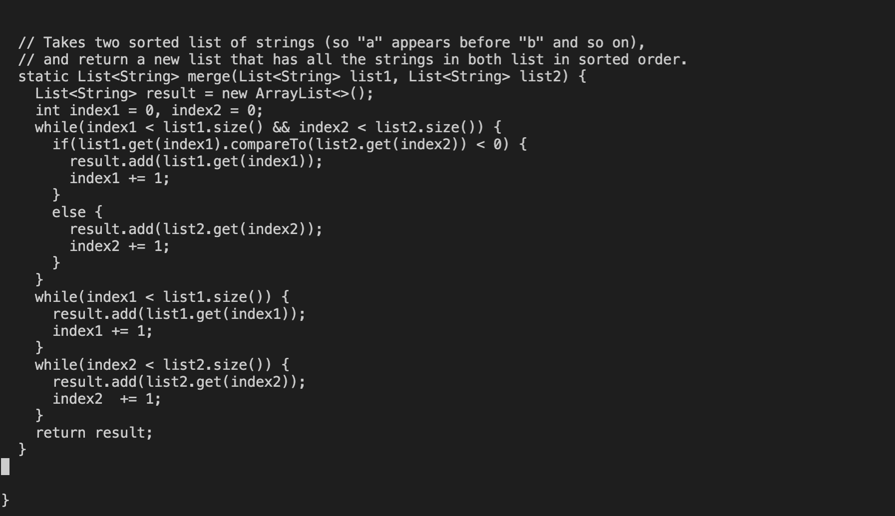

# Lab Report 4 

## Step 1. Log into ieng6
   * To log into my CSE 15L ieng6 account, I used the following key(s):
   * Command(s) used/ Key(s) pressed: `ssh cs15lwi23abn@ieng6.ucsd.edu` or `<up><enter>` (I had already used this command prior to writing this lab report. 
   * Since, I had earlier generated SSH key for my ieng6 account, I wasn't prompted for my password. Instead, I was logged into my account straight away. Please refer to the following screenshot for this step. 
   
 
## Step 2. Clone your fork of the repository from your Github account
   * I opened the desired repository on my Github account. Then, I copied the SSH url from the Code dropdown menu.
   * Next, I typed `git clone` + copied url on the command line in the terminal. 
   * The fork of this repository was finally cloned. Please refer to the following screenshots for the same. 
  

## Step 3. Run the tests, demonstrating that they fail
   * To run the tests, I used the following commands in the given order:
   * Command(s) used/ Key(s) pressed: `cd l` + `<tab><enter>`, `ls`, `javac L` + `<tab>+ . +<tab><enter>`, `<up><up><up><up><up><up><enter>` or `javac -cp .:lib/hamcrest-core-1.3.jar:lib/junit-4.13.2.jar *.java`, `<up><up><up><up><up><up><enter>` or `java -cp .:lib/hamcrest-core-1.3.jar:lib/junit-4.13.2.jar org.junit.runner.JUnitCore `+ `L` + `<tab>` + `T` + `<tab><enter>`. 
   * I noticed that the test file failed and gave one failure. Please refer to the following screenshot for this step. 
   * Note that the commands used above are only valid for Mac/Linux OS users. For window users, please use these JUnit test compilation commands: `javac -cp ".;lib/hamcrest-core-1.3.jar;lib/junit-4.13.2.jar" *.java` and `java -cp ".;lib/junit-4.13.2.jar;lib/hamcrest-core-1.3.jar" org.junit.runner.JUnitCore ` respectively.  
   
  

## Step 4. Edit the code file to fix the failing test
   * To edit the code file, I typed the command : `nano ListExamples.java`. This command will open the ListExamples.java file in the Nano text editor where I further edited the code. Please refer to the following screenshot(s) to see me using this command.  
   * Looking at the code in the Nano text editor (2nd screenshot), you can tell that the error is in the third while loop where the wrong variable "index1" was getting incremented instead of "index2". 
   * To fix this, I used the following command(s) and key(s): `Ctrl-W` + `index1` + `<enter>` + `Ctrl-W` + `<enter>` + `Ctrl-W` + `<enter>` + `Ctrl-W` + `<enter>` + `Ctrl-W` + `<enter>` + `Ctrl-W` + `<enter>` + `Ctrl-W` + `<enter>` + `Ctrl-W` + `<enter>`,  `<right><right><right><right><Option-Right><Option-Right>` + `<delete>` + `2`, `Ctrl-O` + `<enter>` + `<Ctrl-X>`. 
   * Please note that if you're using a Windows device, you will have to use `<Alt-Right><Alt-Right>` instead of just `<Option-Right><Option-Right>`. Also,refer to the following screenshot for my updated code. 
 

## Step 5. Run the tests, demonstrating that they now succeed
   * To run the tests again, I used the following keys: `<up><up>`.
   * 
   * 
   

## Step 6. Commit and push the resulting change to your Github account (you can pick any commit message!)
   * 
   * 

***Thank you for reviewing my lab report, appreciate it!*** 
