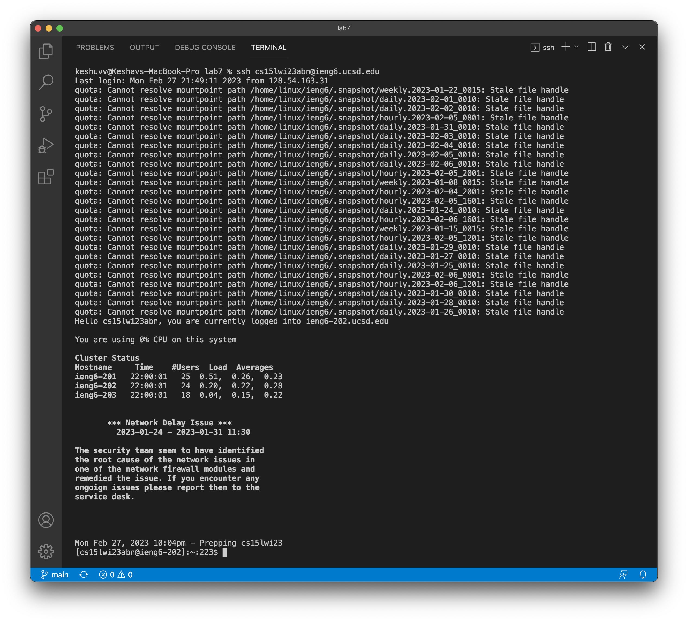
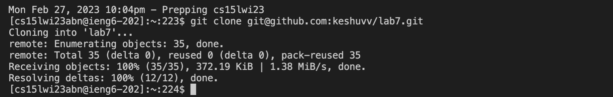
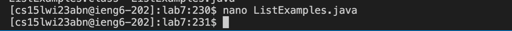
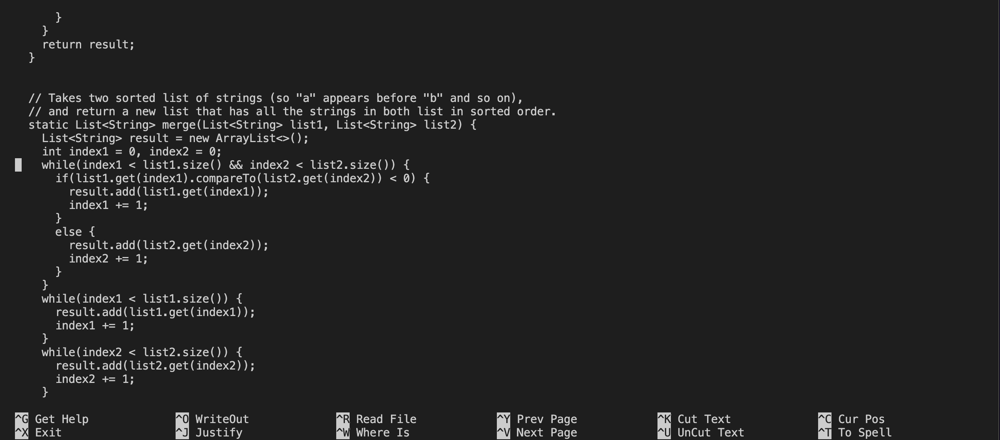
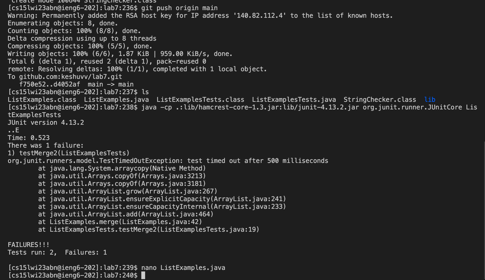
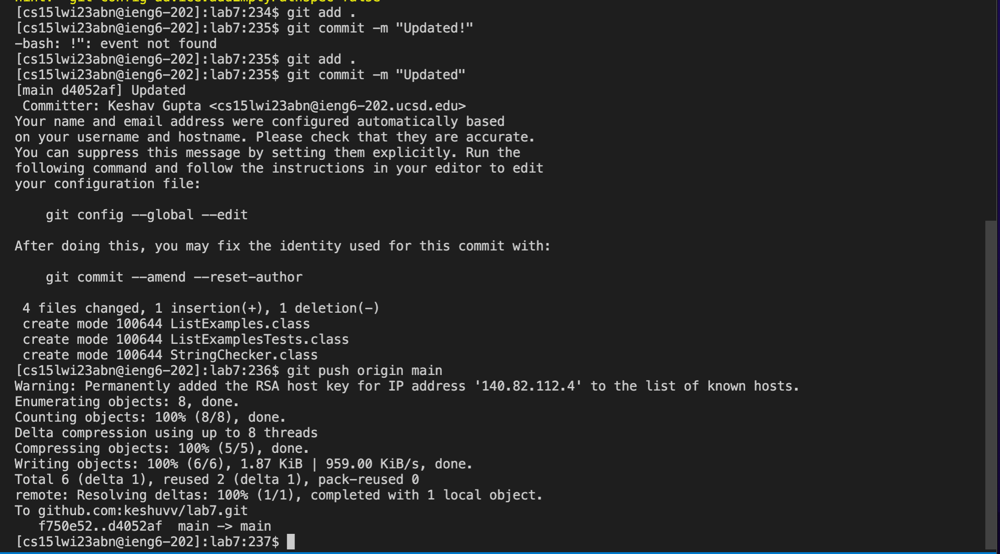

# Lab Report 4 

## Step 1. Log into ieng6
   * 
   *
   
   
## Step 2. Clone your fork of the repository from your Github account
   * 
   * 

## Step 3. Run the tests, demonstrating that they fail
   * 
   * 

## Step 4. Edit the code file to fix the failing test
   * 
   * 
   * 

## Step 5. Run the tests, demonstrating that they now succeed
   * 
   * 

## Step 6. Commit and push the resulting change to your Github account (you can pick any commit message!)
   * 
   *

 
***Thank you for reviewing my lab report, appreciate it!*** 
