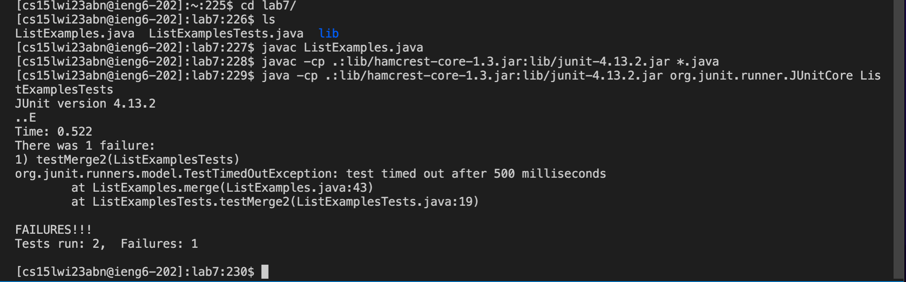

# Lab Report 4 

## Step 1. Log into ieng6
   * To log into my CSE 15L ieng6 account, I used the following key(s):
   * Command(s) used/ Key(s) pressed: `ssh cs15lwi23abn@ieng6.ucsd.edu` or `<up><enter>` (I had already used this command prior to writing this lab report. 
   * Since, I had earlier generated SSH key for my ieng6 account, I wasn't prompted for my password. Instead, I was logged into my account straight away. Please refer to the following screenshot for this step. 
   
 
## Step 2. Clone your fork of the repository from your Github account
   * 
   * 
   * 
  

## Step 3. Run the tests, demonstrating that they fail
   * 
   * 
  

## Step 4. Edit the code file to fix the failing test
   * 
   * 
   * 
 

## Step 5. Run the tests, demonstrating that they now succeed
   * 
   * 
   

## Step 6. Commit and push the resulting change to your Github account (you can pick any commit message!)
   * 
   * 
   
 
***Thank you for reviewing my lab report, appreciate it!*** 
