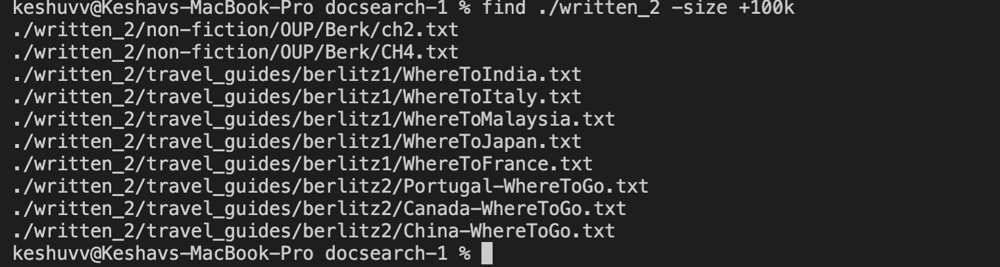
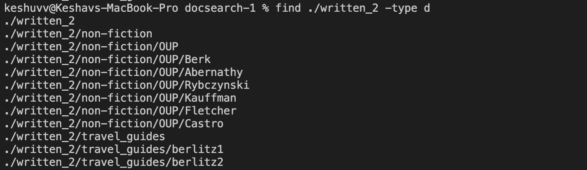
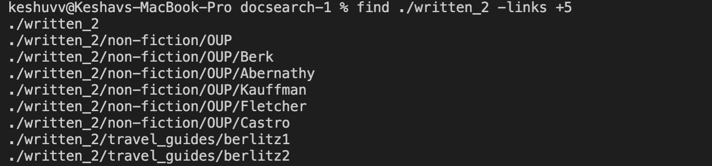

# Lab Report 5 

## For this lab report, I have chosen the `find` command. Following are some of the command line options for `find` that I found interesting:_ 

## 1. `-size n` option 
   * Description: This command-line option is used to filter the search results according to the size of files. The `n` parameter is for different size types, which are as follows: `b`- for 512-byte blocks (default), `c` - for bytes, `w`- for two-byte words, `k` - for kibibytes, `M` - for mebibytes, and `G` - for gibibytes.      [Source](https://man7.org/linux/man-pages/man1/find.1.html)
                  
   * __Example 1__: For the first example, I tried looking for all the files within the './written_2' directory of size more than 100 kibibytes. Please refer to the following screenshot to see the implementation of this example and the result I obtained. 
   * __Example 2__: Now, for the second example, I wanted to find all the files within the './written_2' directory of size more than 200 kibibytes. Please refer to the following screenshot to see the implementation of this example and the result I obtained. 
   
## 2. `-type ` option 
   * Description: This command-line option is used to filter search results based on the different types of file: regular file, directory, symbolic link, block, character, named pipe, socket, and door. [Source](https://man7.org/linux/man-pages/man1/find.1.html)
        
   * __Example 1__: For the first example, I tried looking for only the sub-directories within the './written_2' directory. Please refer to the following screenshot to see the implementation of this example and the result I obtained. 
   * __Example 2__: For the second example, I wanted to find only regular files within the './written_2' directory. Please refer to the following screenshot to see the implementation of this example and the result I obtained. 
  

## 3. `-empty ` option
   *  Description: This command-line option is used to find the files/directories that are empty, i.e. have no content. [Source](https://man7.org/linux/man-pages/man1/find.1.html)
           
   * __Example 1__: For the first example, I tried finding all the empty files within the ./witten_2 directory. The command that I used for the same was: `find ./written_2 -type f -empty`. Here, I am also using the previous command-line option `type` to define that I am strictly interested in findig empty 'files' and not directories, etc. 
   * The result I obtained for this was that there were no empty files in the directory that I had passed. Please refer to the following screenshot to see the implementation of this example and the result I obtained. 
 
   * __Example 2__: For the second example, I wanted to find all the empty directories within the ./witten_2 directory. The command that I used for the same was: `find ./written_2 -type d -empty`. 
   * It again gave me no result, which meant that there were no empty directories either. 
   * To verify the working of this command-line option, I created two empty directories within the `./wirtten_2` directory by using these commands: `mkdir ./written_2/new_directory`, `mkdir ./written_2/new_folder`. Now, this time when I passed the `find ./written_2 -type d -empty` command again, I got the list of empty directories. Please refer to the following screenshot to see the implementation of this example and the result I obtained. 

## 4. `-links n` option
   * Description: This command-line option is used to find the files based on the number of hard links that point to them. [Source](https://man7.org/linux/man-pages/man1/find.1.html)
           
   * __Example 1__: For the first example, I tried finding all the files within the ./witten_2 directory with exactly 5 hard links. The command that I used for the same was: `find ./written_2 -links 5`. Please refer to the following screenshot to see the implementation of this example and the result I obtained. 
   * __Example 2__: For the first example, I was curious to find all the files within the ./witten_2 directory with more than 5 hard links. The command that I used for the same was: `find ./written_2 -links +5`. Please refer to the following screenshot to see the implementation of this example and the result I obtained. 
 
***Thank you for reviewing my lab report, appreciate it!*** 
